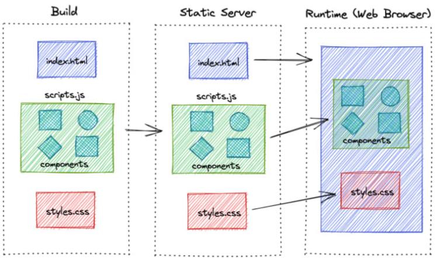

<div align="center">
    
    <h2>
        <b> React2 수업 요약 정리 </b>
    </h2>
    <h3 style="text-align: right">
        최상현 / 202030138
    </h3>
    <p>
        <b> React2 수업 내용에 대해 정리한 문서입니다. 종강 이후 다른 계정(Private)에 수업 내용을 전반적으로 정리하여 주차별이 아닌 주제별로 정리합니다. </b>
    </p>
</div>


# 📜 Index
### <a href="#indexWeek1">📝 1 주차 내용 정리</a>
### <a href="#indexWeek2">📝 2 주차 내용 정리</a>
### <a href="#indexWeek3">📝 3 주차 내용 정리</a>
### <a href="#indexWeek4">📝 4 주차 내용 정리</a>
### <a href="#indexWeek5">📝 5 주차 내용 정리</a>
### <a href="#indexWeek6">📝 6 주차 내용 정리</a>
### <a href="#indexWeek7">📝 7 주차 내용 정리</a>
### <a href="#indexWeek8">📝 8 주차 내용 정리</a>
### <a href="#indexWeek9">📝 9 주차 내용 정리</a>


# 📝 1 주차 내용 정리<a id="indexWeek1"></a>
> NEXT.js 개요, 특징, 기능들과 그로 인한 장점을 작성합니다.

### 📕 Next.js 개요
Vercel이 개발한 리액트를 확장한 오픈소스 자바스크립트 웹 프레임워크입니다.

풀스택 웹 프레임워크이며, React의 공식 사이트의 시작하기 문서에서 사용하는 프레임워크를 소개할 때 이 Next.js 프레임워크가 소개됩니다.


### 🖥 CSR, SSR, SSG, ISR
Next.js는 React를 서버 사이드 렌더링(SSR)을 할 수 있게 합니다. 서버가 렌더링 하는 방식 4가지를 작성합니다.

<div align="center">
    
</div>

클라이언트 사이드 렌더링(CSR)

* 웹 페이지를 서버가 아닌 사용자의 개인 브라우저에서 동적으로 생성합니다.
  
* 초기 로딩이 빠르며, 후속 페이지의 변경도 빠릅니다.

* 사용자의 상호작용이 많은 앱이나 게임과 같은 경우에 적합합니다.

<div align="center">
    
</div>

서버 사이드 렌더링(SSR)

* 사용자의 개인 브라우저가 아닌 서버에서 웹 페이지를 완성한 다음 브라우저에 전송합니다.

* 사용자의 요청이 있을 때 마다 갱신합니다.

* 수시로 갱신이 필요한 경우에 적합합니다.

<div align="center">
    
</div>

정적 사이트 생성(SSG)

* 미리 만들어놓은 페이지를 서비스합니다. 사용자의 요청을 따로 갱신하지 않고 새로운 페이지를 서비스합니다.

* 검색 엔진에 적합합니다.

<div align="center">
    
</div>

증분 정적 재생성(ISR)

* 이미 생성된 페이지를 일정 시간이 지난 후 다시 생성합니다.

* 블로그나 뉴스 사이트 정도의 업데이트 컨텐츠에 적합합니다.


### 🛠 Next.js 기능
번들링을 여러 조각으로 나누어 전송합니다.

파일 기반 라우팅을 사용합니다.(페이지 라우팅 또는 앱 라우팅)

SSR, SSG, ISR을 지원합니다.

타입스크립트를 지원합니다.

이전 브라우저에서 최신 기능을 사용할 수 있게 하는 자동 폴리필 기능을 지원합니다.

각 플랫폼, 하드웨어 성능별로 이미지 최적화를 지원합니다.

다국어를 지원합니다.


# 📝 2 주차 내용 정리<a id="indexWeek2"></a>
> 프로젝트를 생성하기 위해 개발 환경을 설정하고 프로젝트를 생성하는 방법과 Next.js의 라우팅 방식 2가지에 대해 작성합니다.

### 🛠 프로젝트 생성
Next.js 프로젝트를 생성하기 위해선 Node.js와 npm을 설치해야합니다. Node.js를 설치하면 npm도 같이 설치됩니다.

Windows 사용자의 경우 일일이 웹을 통하여 프로그램을 설치하는 것이 번거롭다면 chocolatey를 이용하여 Linux처럼 명령어로 설치할 수 있습니다. num과 같은 node 버전을 변경할 수 있는 버전 관리자와 같은 유용한 기능도 쉽게 설치하며 일반적인 VS Code와 같은 응용 프로그램도 터미널 명령어로 설치할 수 있습니다.

```
npx-create-next-app <프로젝트명>
```

Node.js 설치가 완료되었다면 이제 위와 같이 터미널 명령어를 통하여 쉽게 프로젝트를 생성할 수 있습니다.

만약 -4058 에러가 발생했다면 React-App 최초 설치 시 설치 관련 npm 파일들이 없는 것이기 때문에 ```npm install -g create-react-app``` 명령어로 설치한 후 생성합니다. ```-g```는 global 옵션입니다.

<div align="center">
    
</div>

프로젝트명의 경우 작성하지 않으면 터미널에서 따로 프로젝트명을 작성할 수 있게 안내합니다. TypeScript 사용 유무와 같은 옵션의 경우도 함께 설정할 수 있습니다.'

1번째 안내 메시지는 생성할 Next.js 앱의 버전과 이름을 확인합니다.

그 후 첫 번째 체크 사항은 프로젝트 이름을 설정합니다.

두 번째 체크 사항은 TypeScript의 사용 유무를 결정합니다.

세 번째 체크 사항은 ESLint의 사용 유무를 결정합니다. ECMAScript의 오류를 검증하는 도구이지만 상세히 다루지 않겠습니다.

네 번째 체크 사항은 Tailwind CSS로 부트스트랩 프레임워크와 비슷한 기능을 하는 도구입니다. 마찬가지로 상세히 다루지 않습니다.

다섯 번째 체크 사항은 사용자의 취향에 따라 정리하여 관리하고 싶을 때 src 폴더를 생성하여 관리할 지 여부를 결정합니다.

여섯 번째 체크 사항은 앱 라우터의 사용 유무를 결정합니다. 사용하지 않을 시 페이지 라우터를 사용하게 됩니다. 앱 라우터와 페이지 라우터의 자세한 내용은 후술합니다.


### 🖇 라우팅 방식
라우터란 외부 사용자가 도메인을 통해 접속하였을 때 루트 경로로부터 개발자가 제작한 페이지들을 관리하고 연결 및 지정시켜주는 역할을 합니다.

Next.js에는 크게 2가지 라우팅 방식이 있습니다. 페이지 라우팅 방식과 앱 라우팅 방식이 있는데 현재는 앱 라우팅 방식으로 넘어가는 추세입니다.

<div align="center">
    
</div>

우선 페이지 라우팅은 기본 루트 페이지가 pages 폴더 안에 있는 index.js가 됩니다. 만약 second라는 페이지를 만들어 연결하고 싶다면 second라는 이름을 가진 폴더를 생성하고 그 안에 해당 경로(도메인/second)로 이동했을 때 기본으로 출력할 index.js를 생성해야 합니다.

그후 ```<code className={styles.code}>~~~~</code>``` 태그를 찾아 주소에 맞게 수정해주면 됩니다.

<div align="center">
    
</div>

다음으로 앱 라우팅 방식은 페이지 라우팅 방식과 다르게 기본 루트 페이지가 app(src폴더를 생성했다면 src/app) 폴더 안의 page.js가 됩니다.

페이지 라우터와 비슷한 방식으로 "도메인주소/about"이라는 주소에 페이지를 연결하고 싶다면 about이라는 폴더를 생성한 후 index.js를 대신할 page.js를 생성하면 됩니다.

이후 페이지 라우터와 마찬가지로 ```<code className={styles.code}>~~~~</code>``` 태그를 찾아 주소에 맞게 수정해주면 됩니다.


# 📝 3 주차 내용 정리<a id="indexWeek3"></a>
> 렌더링 전략 SSR, CSR, SSG, ISR에 관하여 상세히 작성합니다.

### ⚙ cf. SWC
SWC(Speedy Web Compiler) 는 RUST를 기반으로 작성된 컴파일러입니다. 최신 버전의 자바스크립트를 구 브라우저에서 작동하게 하는 번들러의 기능도 할 수 있습니다. 최근 바벨의 대체 기능을 합니다.

SWC는 Web Assembly를 사용하는 언어로 C, C++, C# Kotlin, 등 Web Assembly를 사용하는 곳이라면 어디든 사용할 수 있으며 WORA와 같은 이점을 얻을 수 있습니다.

따라서 변환 시간이 자바스크립트를 사용하는 바벨에 비해 빠르며, 마찬가지로 Next.js에 내장되어 있어 쉽게 사용할 수 있습니다.


### 💻 렌더링 전략
우선 렌더링 전략이란 웹 페이지나 웹 애플리케이션을 웹 브라우저에 어떻게 띄우는 지에 대한 방법입니다.

전술했듯 렌더링 전략에는 크게 4가지 방식(SSR, CSR, SSG, ISR)이 있는데 Next.js 에서는 이 4가지 방식을 섞어 사용할 수 있습니다.


### 🖥 SSR, CSR
<div align="center">
    
</div>

클라이언트 사이드 렌더링과 서버사이드 렌더링의 특징은 전술했듯 렌더링이 서버 내에서 되는지, 아니면 전송한 후에 클라이언트에서 되는 지의 차이입니다.

따라서 SSR의 경우 이미 렌더링을 해서 전송하기 때문에 보안에 더 좋고, CSR에 비해 SEO에 더 좋은 성능을 발휘합니다. 하지만 그 대신 자원 소모가 크고 서버를 사용해야하며 클라이언트가 요청할 때마다 계속 API나 데이터등을 응답시켜야 합니다.

CSR의 경우 클라이언트에게 렌더링을 맡기기 때문에 한번 렌더링을 하게 되면 모든 페이지가 렌더링되기 때문에 클라이언트가 페이지 이동 시 요청을 할 필요가 없고, 페이지 전환이 훨씬 가벼워집니다. 하지만 보안에 취약할 수 있고, 첫 렌더링 시에 시간이 오래 걸릴 수 있습니다.

<div align="center">
    
</div>

Next.js에서는 하이드레이션을 이용하여 이 두 가지 기능의 장점을 모두 취할 수 있습니다.

우선 서버에서 Pre-Rendering을 통해 렌더링 된 페이지를 클라이언트에 전송하여 뼈대를 갖춘 HTML 페이지를 먼저 제시합니다.

그 후, 번들링된 JS 코드들을 Chunk 단위로 전송하여 클라이언트 사이드에서 HTML 코드와 매칭하여 Re-Rendering 하게 됩니다.

따라서 SSR과 CSR의 방식을 섞어 빠르게 렌더링한 후에 JavaScript를 공급하고, 페이지 전환을 원활하게 해줍니다.


### 🖥 SSG, ISR
SSG는 전체 페이지를 빌드 시점에 렌더링합니다. 따라서 사용자가 요청하면 미리 렌더링되어 있던 페이지가 전송되기 때문에 보안에 있어 안전하고, 정적 컨텐츠가 전송되기 때문에 로드 시간이 빠릅니다.

하지만 정적 페이지들을 빌드했기 때문에 이를 수정하려면 개발자가 다시 빌드해야합니다.

따라서 Next.js는 ISR(증분 정적 재생성)을 사용하는데 정적페이지를 주기적으로 재생성하여 수정된 사항들을 업데이트 합니다.


# 📝 4 주차 내용 정리<a id="indexWeek4"></a>
> Next.js의 라우팅 방식과 동적 라우팅 규칙 및 경로 매개 변수를 작성합니다.
### 🔗 라우팅 방식
Next.js는 기본적으로 page 라우팅 방식(파일 시스템 기반 페이지)과 앱 라우팅 방식을 사용합니다.

<div align="center">
    
</div>

우선 페이지 라우팅 방식은 라우팅의 루트 페이지가 pages 디렉토리의 index.js 에서 시작됩니다.

두 번째 페이지를 연결하고 싶다면 새 디렉토리를 만들어 경로 이름을 지정하고, index.js 페이지를 만들어 출력합니다.

URL 에 ```도메인주소/second```를 입력하면 두 번째 페이지가 출력됩니다.

<div align="center">
    
</div>

앱 라우팅 방식은 루트 디렉토리가 app 디렉토리의 page.js 입니다.

index.js 대신 page.js 를 사용하고, 나머지는 같은 방식으로 이루어져 있습니다.

URL 에 ```도메인주소/about```을 입력하면 두 번째 페이지가 출력됩니다.


### 🔄 동적 라우팅 규칙과 경로 매개 변수
동적 라우팅 규칙은 URL 주소에 컴포넌트 props 를 넣어 전달할 수 있습니다.

<div align="center">
    
</div>

앱 라우팅 방식에서 위 그림과 같이 app 디렉토리 안에 test-routing 디렉토리가 있고 그 안에는 ```[id]```라는 디렉토리가 있으며, 각 디렉토리에는 page.jsx 가 존재합니다.

여기서 ```[id]```는 경로 매개변수가 되며 URL 주소에 ```도메인주소/test-routing/Daelim-123``` 이라고 입력하면 ```test-routing``` 디렉토리 안에 ```[id]```라는 이름의 경로 매개변수에 ```Daelim-123```이라는 값이 넘어갑니다.

```jsx
export default function Id(props) {
    console.log(props);
    return (
        <>
            {/* 동적 라우팅으로의 params 중 [id] 값 */}
            <h1>Hello, {props.params.id}!!</h1>
            {/* 직접 전달 / ?country=korea URL의 제일 뒤에만 가능 */}
            <h1>Your Country: {props.searchParams.country}</h1>
        </>
    );
}
```

```[id]``` 디렉토리 안의 page.jsx 의 내용을 위와 같이 설정해주면 화면에는 ```Hello, Daelim-123!!```이라는 내용이 출력됩니다.

또한 직접 URL 에 ```도메인주소/test-routing/Daelim-123?country=Korea``` 로 경로 변수를 직접 사용할 수 있습니다.

하지만 반드시 마지막 경로 변수로 사용해야하며 URL 에 변수 이름과 같이 민감한 정보가 유출될 수 있습니다.


# 📝 5 주차 내용 정리<a id="indexWeek5"></a>
> 동적 라우팅 규칙에 대하여 앱 라우팅과 페이지 라우팅 방식으로 나누어 작성합니다.
### 📄 페이지 라우팅
<div align="center">
    
</div>

페이지 라우팅은 전술했듯 index.js 가 라우팅의 기본이 되며, pages 폴더 안의 index.js 에서 시작합니다.

새로운 경로를 연결하고 싶다면 위 그림과 같이 second 라는 디렉토리를 생성한 후 디렉토리 안에 index.js 파일을 만들어 라우팅합니다.

<div align="center">
    
</div>

동적 라우팅을 하기 위해선 디렉토리 이름을 ```[]```로 감싸줍니다. URL 에 ```도메인주소/router/sample@gmail.com```을 입력하면 email 이라는 동적 매개 변수에 sample@gmail.com 이라는 값이 전달됩니다.

```jsx
import { useRouter } from "next/router";

export default function Email() {
const router = useRouter();
const { email, id, name } = router.query;
console.log(router);

return (
<>
<h1>Hello, this is Email Page.</h1>
<h1>이메일 : {email}</h1>
<h1>아이디 : {id}</h1>
<h1>이름 : {name}</h1>
</>
);
}
```

동적 매개 변수를 사용할 때에는 페이지 라우터에선 useRouter 를 사용합니다. 라우터 변수를 선언한뒤 query 메서드를 이용하여 동적 매개 변수를 전달받습니다.

```[...변수이름]```을 사용한다면 동적 매개 변수를 배열의 형태로 전달받습니다. URL 주소에 ```도메인주소/router/sample1/sample2/sample3```로 입력한다면 email 이라는 동적 매개 변수에 sample1 ,sample2, sample3이 0, 1, 2번째 인덱스로 전달됩니다.

위 방법은 한 가지 문제가 있는데 URL 주소를 ```도메인주소/router/```까지만 입력한다면 404 오류를 발생시킵니다. router 디렉토리에 만들어 놓은 컴포넌트 역시 라우팅하고 싶다면 ```[[...변수이름]]```를 사용하여 email 동적 매개 변수를 optional 설정하여 null 값으로도 지정받을 수 있게 해야합니다.

마지막으로 GET 방식으로 변수를 전달할 수 있습니다. 라우팅 후 마지막으로 ```?name=user1&id=sample``` 등으로 직접 id와 name 에 경로 변수를 전달합니다.


### 🔌 앱 라우팅
<div align="center">
    
</div>

앱 라우팅 방식은 페이지 라우팅 방식과 유사하나, 약간의 차이가 있습니다.

우선 페이지 라우팅과 마찬가지로 라우팅을 위해선 새 디렉토리를 만들어야하며 index.js 대신 page.js 를 만들어야 합니다. 여기서 페이지 라우팅 방식과의 차이는 앱 라우팅은 반드시 page.js 가 존재해야 합니다.

마찬가지로 위 그림과 같을 때 ```도메인주소/about```을 입력하면 선택한 page.js 가 출력됩니다.

<div align="center">
    
</div>

동적 라우팅 역시 비슷한데 페이지 라우팅과 같은 구조로 이루어지지만 페이지 라우팅의 경우 디렉토리가 아닌 파일도 동적 매개 변수로 만들 수 있지만 앱 라우팅은 오직 디렉토리 파일만 동적매개변수로 정할 수 있습니다.

```jsx
export default function Name(props) {
  console.log(props);

  return (
    <>
      <h1>이름 : {props.params.name}</h1>
      <h1>이메일 : {props.searchParams.email}</h1>
      <h1>아이디 : {props.searchParams.id}</h1>
    </>
  );
}
```

또 다른 차이점은 앱 라우팅은 useRouter 를 사용하지 않으며 props 를 사용하여 ```{props.params.동적매개변수이름}```을 통해 동적 변수를 전달받습니다.

또한 GET 방식을 이용한 URL 경로 변수를 받을 때에는 ```{props.searchParams.경로변수이름}```을 통해 경로 변수를 전달받습니다.


# 📝 6 주차 내용 정리<a id="indexWeek6"></a>
> 두 가지 라우터의 레이아웃을 설정하는 방법과 링크 방법, 정적 자원을 사용하는 방법에 대해 작성합니다.
### 📄 페이지 라우터 레이아웃

페이지 레이아웃의 경우 App.js 와 document.js 를 통해 레이아웃을 구현합니다.

공통적으로 두 파일 모두 자식 컴포넌트 디렉토리 위치마다 생성할 수 있으며 부모의 레이아웃 안의 자식 컴포넌트 안에서 자식 레이아웃을 적용하게 됩니다.

```jsx
import "@/styles/globals.css";

export default function App({ Component, pageProps }) {
  return 
    <>
        <Navbar />
        <Component {...pageProps} />;
    </>
}
```

App.js는 컴포넌트의 근본이 되는 컴포넌트로 이 컴포넌트의 출력에 각각의 태그 안에 외부 컴포넌트를 import 합니다.

위 코드와 같이 return 출력 부분에 네비게이션바를 추가하고 싶어 ```<Navbar />``` 컴포넌트를 넣어주면 후에 오는 모든 자식 컴포넌트에 네비게이션이 위에 위치하게 됩니다.

```jsx
import { Html, Head, Main, NextScript } from "next/document";

export default function Document() {
  return (
    <Html lang="en">
      <Head />
      <body>
        <Main />
        <NextScript />
      </body>
    </Html>
  );
}
```

Document.js 의 구성은 위 코드와 같으며, 컴포넌트의 출력으로 일반적인 HTML 의 시멘틱 구조를 갖추고 있습니다.

시멘틱 구조를 수정하여 레이아웃을 설정할 수 있으며, 역시 마찬가지로 후에 오는 모든 자식 컴포넌트에 적용됩니다.


### 🔌 앱 라우터 레이아웃
앱 라우터에서는 layout.js 파일 하나로 app.js 와 document.js 파일을 대체합니다.

```jsx
import RootHeader from "./components/RootHeader";
import RootFooter from "./components/RootFooter";
import NavBar from "./components/NavBar";

export const metadata = {
  title: "Next.js Page",
  description: "Generated by create next app",
};

export default function RootLayout({ children }) {
  return (
    <html lang="ko">
      <body>
        <RootHeader />
        <NavBar />
        <main>{children}</main>
        <RootFooter />
      </body>
    </html>
  );
}
```

layout.js 파일은 위 코드와 같이 작성되며, 컴포넌트 똔느 컴포넌트 태그를 통해 html 처럼 표현할 수 있습니다.

layout.js 파일은 app 디렉토리에 위치하며, 삭제하여도 프로젝트를 run 하게되면 자동으로 생성됩니다.

props 의 ```{children}```을 통해 자식 컴포넌트가 어디에 위치할 지 결정할 수 있습니다. 


### 🔗 링크
next.js 에서 링크할 수 있는 방법은 크게 3가지가 있습니다. 기본적인 HTMl 의 a 태그를 이용하는 방법과 Next.js 에서 제공하는 기능을 이용하는 방법입니다.

라우터와 Link 방법을 이용한다면 Next.js는 기본적으로 라우팅되는 모든 Link 에 연결된 페이지를 미리 읽어오기 때문에 페이지를 로드하지 않고 빠르고 부드럽게 렌더링할 수 있습니다. 이 기능은 컴포넌트에 ```period={false}```라는 기능을 이용하여 비활성화할 수 있습니다. 

```js
<a href="www.test.com">사이트 이동</a>
```

우선 가장 간단한 a 태그를 사용하는 방법입니다. 이는 HTML 과 같은 방식으로 작성합니다. 해당 링크로 이동하기 때문에 페이지가 새로고침됩니다.

```js
<Link href='/blog/[date]/[slug]' as="/bolg/2024-10-10/sleep">블로그로 이동하기<Link/>
```

두번 째 방법으로는 Link 컴포넌트를 사용하는 방법입니다. 위 코드와 같이 href 속성에 렌더링할 라우터 주소를 입력하고, as 속성에 주소창에 입력될 코드를 입력할 수 있습니다. 하지만 현재는 as 속성을 굳이 사용하지 않습니다.

```jsx
import { useRouter } from 'next/router';

export default function() {
    const router = useRouter();
    
    useEffect(() => {
        if (!loggedIn) {
            router.push('/login');
        }        
    }, [loggedIn]);    
}
```
마지막 방법은 useRouter 를 이용하는 방법입니다. router 변수를 선언한 후에 push 메서드로 라우팅 주소를 입력하여 이동합니다.


### 🖼 정적 자원 제공
정적 자원은 이미지, 폰트, 아이콘, 컴파일한 css 또는 js 파일과 같이 동적으로 변하지 않는 모든 종류의 파일입니다.

대부분 public 폴더에 올려 사용합니다.

<div align="center">
    
</div>

일반적으로 최적화 되지 않은 이미지를 사용하게 되면 누적 레이아웃 이동(CLS)이 발생합니다.

이미지를 너무 늦게 불러와 사용자가 이미 비교적 빨리 로드된 콘텐츠들을 사용하는 도중 이미지 로드가 완료되면서 콘텐츠의 위치가 바뀌어버리는 현상입니다.

또한 늦게 로드되는 컴포넌트가 누적될수록 변경되는 위치는 더욱 커질 수 밖에 없습니다.

Next.js 에서는 이미지 최적화 기능을 사용하여 이미지를 WebP 파일 형식으로 포맷하여 제공합니다.

```jsx
module.exports = {
    images: {
        domains: ['images.unsplash.com']
    }
}
```

next.config.js 파일에서 다음과 같은 코드를 입력하여 Unsplash 에서 이미지 최적화 기능을 제공할 수 있게 설정합니다.

```jsx
export default function IndexPage() {
    return (
      <div>
          <Image
              src='이미지 주소'
              width={500}
              height={200}
              alt='image'
          />
      </div>    
    );
}
```
그 후 Image 컴포넌트를 이용하여 위의 예시와 같이 이미지를 삽입할 수 있습니다.


# 📝 7 주차 내용 정리<a id="indexWeek7"></a>
> 이미지를 최적화하는 방법과 디렉토리 구조에 대해 작성합니다.
### 🖼 이미지 최적화
<div align="center">
    
</div>

정적 자원은 이미지, 폰트, 아이콘, 컴파일한 CSS 또는 JS 파일과 같이 동적으로 변하지 않는 모든 파일을 뜻합니다.

Next.js 에서는 이미지 최적화 기능을 통해 CLS(누적 레이아웃 이동)를 방지합니다. 또 이미지를 WebP와 같은 최신 이미지 포맷으로 제공합니다. 만약 사용자의 브라우저가 WebP 를 지원하지 않을 경우 사용자의 브라우저에 맞추어 이미지를 포맷합니다.

```jsx
/** @type {import('next').NextConfig} */
const nextConfig = {
        reactStrictMode: true,
        images: {
            remotePatterns: [
                {
                    protocol: "https",
                    hostname: "cdn.pixabay.com",
                },
                {
                    protocol: "https",
                    hostname: "images.unsplash.com",
                },
            ],
        },
    };

export default nextConfig;

```

next.config.js 파일에 설정을 추가함으로써 이미지 최적화를 수행할 수 있습니다. ```cdn.pixababy.com``` 과 ```images.unsplash.com```에서 링크를 받아오는 이미지 태그들은 이미지 최적화 기능을 제공합니다.


### 📁 디렉터리 구조
Next.js 에서는 특정 파일과 디렉터리가 지정된 위치에 있어야 합니다. 레이아웃을 설정하는 layout.js 파일과 같은 것들이 해당됩니다.

루트 디렉토리
* ```node_modules/``` -  Next.js 프로젝트의 의존성 패키지를 설치하는 디렉터리입니다. 흔히 ```$ npm install``` 명령어로 패키지를 설치할 때 이 폴더 안에 설치됩니다.
* ```app/``` - 앱 라우터 프로젝트의 라우팅 시스템을 만드는 디렉터리입니다. 이 디렉터리 안의 page.js 파일이 앱 라우팅의 루트가 됩니다. 
* ```public/``` - 컴파일된 css 및 js 파일, 이미지 아이콘 등 정적 자원들을 저장하고 제공하는 디렉터리입니다.
* ```styles/``` - 스타일링 모듈을 저장하는 디렉터리입니다.

아토믹 디자인 원칙
1. atoms - 원자와 같이 더 이상 쪼갤 수 없을 정도의 가장 기본적인 컴포넌트 입니다. 표준 HTML 요소를 감싸는 용도로 사용됩니다.
2. molecules - atoms 에 속한 컴포넌트들을 조합하여 컴포넌트를 만듭니다.
3. organisms - molecules 와 atoms 를 조합하여 복잡한 구조의 컴포넌트를 만듭니다.
4. templates - 위 3가지 atoms, molecules, organisms 를 조합하여 사용자가 접근할 수 있는 페이지를 만듭니다.

유틸리티 파일은 렌더링하는 컴포넌트가 없는 코드 파일입니다. 유틸리티 스크립트라고 하며 로직 수행 등 다양한 용도로 사용됩니다. 이러한 유틸리티 파일 역시 ```utilities/``` 디렉토리 아래에 패키지와 같이 용도에 맞게 묶어 분류합니다.

정적 자원은 ```public/``` 디렉터리 아래 ```assets/``` 디렉터리를 만들어 정적 파일의 유형별로 묶어 관리합니다.


# 📝 8 주차 내용 정리<a id="indexWeek8"></a>
> Rest API 를 호출하는 방법애 대해 작성합니다.

REST API 는 자원을 이름(key)으로 구분하여 자원 상태(value)를 통신하는 방법을 따르는 API 입니다. 흔히 json 데이터 형식을 이용하여 통신합니다.

* URI - Uniform Resource Identifier. 리소스 자원을 식별자를 뜻합니다.
* URL - Uniform Resource Location. 리소스 자원의 위치를 뜻합니다.

HTTP Methods 에는 GET, POST, DELETE, PUT, PATCH 등이 있으며 CRUD 에 있어 아래와 같이 사용합니다.
* Create - POST
* Read - GET
* Update- PUT, PATCH
* Delete - DELETE

REST API 에도 네이밍 컨벤션이 존재하며 아래와 같습니다.
* 동사보단 명사를 사용합니다.
* path 와 혼동되지 않게 "/" 로 끝내지 않습니다.
* 단어 연결 시 하이폰(-)을 사용합니다.
* 확장자(.jpg 등)는 URI 에 포함시키지 않습니다.
* HTTP Methods 는 혼동될 수 있으므로 URI 에 포함시키지 않습니다.

Json server
```shell
$ npm install -g json-server
$ json-server ~파일이름~ --port ~포트번호~
```

위 명령어를 통해 json 서버를 설치하고 json 데이터 파일과 포트번호를 지정하여 json 서버를 실행시킵니다.

서버에서 REST API 를 호출하는 방법은 크게 두 가지로 나뉩니다. 첫 번째는 Node.js 의 내장 HTTP 라이브러리(fetch())를 사용하는 것이고, 두 번째는 HTTP 클라이언트 라이브러리(Axios)를 사용하는 방법입니다.


### 🔍 fetch-API
```jsx
let testData = await fetch("https://api.vercel.app/blog");
let testPosts = await testData.json();
```
fetch-api 는 브라우저에 내장되어 있어 별도로 설치하지 않아도 됩니다.

Promise 기반으로 비동기로 작업을 처리합니다.

데이터 스트리밍 처리가 가능하여 큰 파일을 처리할 때 유용합니다.

하지만 위 코드와 같이 json 을 직접 변환하여 사용해야합니다.


### 🔎 Axios
Axios 는 HTTP 클라리언트 라이브러리로 ```$ npm install axios``` 명령어를 통해 따로 설치해야합니다.

```jsx
const res = await axios.get("http://localhost:3001/test");
const users = res.data;
const status = res.status(); 
const headers = res.headers();
const conf = res.conf();
```

json 데이터를 자동으로 변환해주기 때문에 json 데이터에 쉽게 접근할 수 있습니다.

HTTP 요청 도중 취소할 수 있고, 요청 / 응답을 가로채어 수정할 수 있습니다.

HTTP 상태 코드에 따라 더 세분화하여 오류를 처리할 수 있습니다.


# 📝 9 주차 내용 정리<a id="indexWeek9"></a>
> CSS 와 내장 스타일링 메서드에 대해 작성합니다.

Next.js 에서 CSS 를 적용하는 방법엔 크게 2가지로 나뉩니다. Next.js 에서 기본 내장되어있는 CSS 모듈을 사용하는 방법과 SASS 패키지를 설치하여 사용하는 방법입니다.

### 💾 내장 패키지 사용
```jsx
<span>Span Tag</span>
<button className="button">클릭</button>
<style jsx>{`
.button {
    padding: 1em;
    border-radius: 15px;
    border: none;
    background: purple;
    color: white;
}
span {
    background: yellow;
    font-weight: bold;
}
`}</style>
```

Styled JSX 는 css-in-JS 라이브러리로 CSS 속성을 지정할 때 자바스크립트를 사용할 수 있습니다.

위 코드와 같이 ```.button``` 으로 클래스를, ```span```으로 태그를 지정하여 css 를 적용할 수 있습니다.

```<style jsx>``` 태그에 global 을 붙여 ```<style jsx global>```로 만들어 글로벌 css 로 사용할 수 있지만 통상 글로벌 css 는 layout 이나 한 곳에 모아 사용하므로 이 사용은 지양합니다.

styled 를 사용하게 되면 IDE, 개발 도구에서 지원이 부족한 경우가 종종 있습니다.(문법 하이라이팅, 자동 완성 기능, 린팅) 또한 CSS 에 대한 의존성이 커지기도 합니다. 또한 리액트 하이드레이션이 끝나면 css 를 또 다시 생성해야합니다. 이런 방식으로 계속 진행하면 서버 부하가 매우 부담될 수 있습니다.

```css
.page {
    --gray-rgb: 0, 0, 0;
    --gray-alpha-200: rgba(var(--gray-rgb), 0.08);
    --gray-alpha-100: rgba(var(--gray-rgb), 0.05);

    --button-primary-hover: #383838;
    --button-secondary-hover: #f2f2f2;

    display: grid;
    grid-template-rows: 20px 1fr 20px;
    align-items: center;
    justify-items: center;
    min-height: 100svh;
    padding: 80px;
    gap: 64px;
    font-family: var(--font-geist-sans);
    
    .className {
        color: green;
        background: red;
    }

    .otherClassName {
        composes: className;
        color: yellow;
    }
}
```

```jsx
import styles from "./page.module.css";
```

두 번째 방법인 CSS Module 파일을 만들어 사용함으로써 해결할 수 있습니다. ```~css 파일 이름~.module.css``` 파일을 만들어 그 안에 css 규칙을 생성하고, 사용할 컴포넌트 jsx 페이지에서 import 하여 사용합니다.

또한 ```composes``` 키워드를 이용하여 셀렉터 컴포지션 기능으로 정의해놓은 속성을 그대로 가져와 적용시킬 수 있습니다.

만약 global css 로 사용하고 싶다면 ```app/``` 디렉토리의 ```layout.js``` 페이지에서 import 하여 사용하면 됩니다.

```css
.page:global {
    --gray-rgb: 0, 0, 0;
    --gray-alpha-200: rgba(var(--gray-rgb), 0.08);
    --gray-alpha-100: rgba(var(--gray-rgb), 0.05);

    --button-primary-hover: #383838;
    --button-secondary-hover: #f2f2f2;

    display: grid;
    grid-template-rows: 20px 1fr 20px;
    align-items: center;
    justify-items: center;
    min-height: 100svh;
    padding: 80px;
    gap: 64px;
    font-family: var(--font-geist-sans);
}
```
두 번째 방법은 위 코드와 같이 ```:global``` 키워드를 붙여 사용하는 것인데, 전술했듯이 global css 는 모아 사용하는 것이 좋습니다.


### 📦 외부 패키지 SASS 사용
```shell
$ npm install sass
```
CSS 전처리기인 SASS 를 사용할 수 있습니다. 위 명령어를 통해 SASS 를 설치합니다.

```~css 파일이름~.module.scss``` 파일을 만들어 사용합니다.

자세한 문법은 [공식 사이트](https://sass-lang.com/)를 참고합니다.

```scss
$color: rgb(44, 0, 102);

.myDiv {
  font-size: 50px;
  color: $color;
}
```

SASS 의 특징이라고 한다면 css 속성을 변수처럼 만들어 사용할 수 있습니다. 위와 같이 ```$```를 이용하여 css 변수를 생성한 후 일반적인 css 규칙과 마찬가지로 속성에 css 변수를 넣어 사용할 수 있습니다.