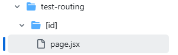

<div align="center">
    
    <h3>
        <b> React2 수업 요약 정리 </b>
    </h3>
    <p>
        <b> React2 수업 내용에 대해 정리한 문서입니다. 종강 이후 다른 계정(Private)에 수업 내용을 전반적으로 정리하여 주차별이 아닌 주제별로 정리합니다. </b>
    </p>
</div>


# 📜 Index
### <a href="#indexWeek1">📝 1 주차 내용 정리</a>
### <a href="#indexWeek2">📝 2 주차 내용 정리</a>
### <a href="#indexWeek3">📝 3 주차 내용 정리</a>
### <a href="#indexWeek4">📝 4 주차 내용 정리</a>


# 📝 1 주차 내용 정리<a id="indexWeek1"></a>
> NEXT.js 개요, 특징, 기능들과 그로 인한 장점을 작성합니다.

### 📕 Next.js 개요
Vercel이 개발한 리액트를 확장한 오픈소스 자바스크립트 웹 프레임워크입니다.

풀스택 웹 프레임워크이며, React의 공식 사이트의 시작하기 문서에서 사용하는 프레임워크를 소개할 때 이 Next.js 프레임워크가 소개됩니다.


### 🖥 CSR, SSR, SSG, ISR
Next.js는 React를 서버 사이드 렌더링(SSR)을 할 수 있게 합니다. 서버가 렌더링 하는 방식 4가지를 작성합니다.

<div align="center">
    
</div>

클라이언트 사이드 렌더링(CSR)

* 웹 페이지를 서버가 아닌 사용자의 개인 브라우저에서 동적으로 생성합니다.

* 초기 로딩이 빠르며, 후속 페이지의 변경도 빠릅니다.

* 사용자의 상호작용이 많은 앱이나 게임과 같은 경우에 적합합니다.

<div align="center">
    
</div>

서버 사이드 렌더링(SSR)

* 사용자의 개인 브라우저가 아닌 서버에서 웹 페이지를 완성한 다음 브라우저에 전송합니다.

* 사용자의 요청이 있을 때 마다 갱신합니다.

* 수시로 갱신이 필요한 경우에 적합합니다.

<div align="center">
    
</div>

정적 사이트 생성(SSG)

* 미리 만들어놓은 페이지를 서비스합니다. 사용자의 요청을 따로 갱신하지 않고 새로운 페이지를 서비스합니다.

* 검색 엔진에 적합합니다.

<div align="center">
    
</div>

증분 정적 재생성(ISR)

* 이미 생성된 페이지를 일정 시간이 지난 후 다시 생성합니다.

* 블로그나 뉴스 사이트 정도의 업데이트 컨텐츠에 적합합니다.


### 🛠 Next.js 기능
번들링을 여러 조각으로 나누어 전송합니다.

파일 기반 라우팅을 사용합니다.(페이지 라우팅 또는 앱 라우팅)

SSR, SSG, ISR을 지원합니다.

타입스크립트를 지원합니다.

이전 브라우저에서 최신 기능을 사용할 수 있게 하는 자동 폴리필 기능을 지원합니다.

각 플랫폼, 하드웨어 성능별로 이미지 최적화를 지원합니다.

다국어를 지원합니다.


# 📝 2 주차 내용 정리<a id="indexWeek2"></a>
> 프로젝트를 생성하기 위해 개발 환경을 설정하고 프로젝트를 생성하는 방법과 Next.js의 라우팅 방식 2가지에 대해 작성합니다.

### 🛠 프로젝트 생성
Next.js 프로젝트를 생성하기 위해선 Node.js와 npm을 설치해야합니다. Node.js를 설치하면 npm도 같이 설치됩니다.

Windows 사용자의 경우 일일이 웹을 통하여 프로그램을 설치하는 것이 번거롭다면 chocolatey를 이용하여 Linux처럼 명령어로 설치할 수 있습니다. num과 같은 node 버전을 변경할 수 있는 버전 관리자와 같은 유용한 기능도 쉽게 설치하며 일반적인 VS Code와 같은 응용 프로그램도 터미널 명령어로 설치할 수 있습니다.

```
npx-create-next-app <프로젝트명>
```

Node.js 설치가 완료되었다면 이제 위와 같이 터미널 명령어를 통하여 쉽게 프로젝트를 생성할 수 있습니다.

만약 -4058 에러가 발생했다면 React-App 최초 설치 시 설치 관련 npm 파일들이 없는 것이기 때문에 ```npm install -g create-react-app``` 명령어로 설치한 후 생성합니다. ```-g```는 global 옵션입니다.

<div align="center">
    
</div>

프로젝트명의 경우 작성하지 않으면 터미널에서 따로 프로젝트명을 작성할 수 있게 안내합니다. TypeScript 사용 유무와 같은 옵션의 경우도 함께 설정할 수 있습니다.'

1번째 안내 메시지는 생성할 Next.js 앱의 버전과 이름을 확인합니다.

그 후 첫 번째 체크 사항은 프로젝트 이름을 설정합니다.

두 번째 체크 사항은 TypeScript의 사용 유무를 결정합니다.

세 번째 체크 사항은 ESLint의 사용 유무를 결정합니다. ECMAScript의 오류를 검증하는 도구이지만 상세히 다루지 않겠습니다.

네 번째 체크 사항은 Tailwind CSS로 부트스트랩 프레임워크와 비슷한 기능을 하는 도구입니다. 마찬가지로 상세히 다루지 않습니다.

다섯 번째 체크 사항은 사용자의 취향에 따라 정리하여 관리하고 싶을 때 src 폴더를 생성하여 관리할 지 여부를 결정합니다.

여섯 번째 체크 사항은 앱 라우터의 사용 유무를 결정합니다. 사용하지 않을 시 페이지 라우터를 사용하게 됩니다. 앱 라우터와 페이지 라우터의 자세한 내용은 후술합니다.


### 🖇 라우팅 방식
라우터란 외부 사용자가 도메인을 통해 접속하였을 때 루트 경로로부터 개발자가 제작한 페이지들을 관리하고 연결 및 지정시켜주는 역할을 합니다.

Next.js에는 크게 2가지 라우팅 방식이 있습니다. 페이지 라우팅 방식과 앱 라우팅 방식이 있는데 현재는 앱 라우팅 방식으로 넘어가는 추세입니다.

<div align="center">
    
</div>

우선 페이지 라우팅은 기본 루트 페이지가 pages 폴더 안에 있는 index.js가 됩니다. 만약 second라는 페이지를 만들어 연결하고 싶다면 second라는 이름을 가진 폴더를 생성하고 그 안에 해당 경로(도메인/second)로 이동했을 때 기본으로 출력할 index.js를 생성해야 합니다.

그후 ```<code className={styles.code}>~~~~</code>``` 태그를 찾아 주소에 맞게 수정해주면 됩니다.

<div align="center">
    
</div>

다음으로 앱 라우팅 방식은 페이지 라우팅 방식과 다르게 기본 루트 페이지가 app(src폴더를 생성했다면 src/app) 폴더 안의 page.js가 됩니다.

페이지 라우터와 비슷한 방식으로 "도메인주소/about"이라는 주소에 페이지를 연결하고 싶다면 about이라는 폴더를 생성한 후 index.js를 대신할 page.js를 생성하면 됩니다.

이후 페이지 라우터와 마찬가지로 ```<code className={styles.code}>~~~~</code>``` 태그를 찾아 주소에 맞게 수정해주면 됩니다.


# 📝 3 주차 내용 정리<a id="indexWeek3"></a>
> 렌더링 전략 SSR, CSR, SSG, ISR에 관하여 상세히 작성합니다.

### cf. SWC
SWC(Speedy Web Compiler) 는 RUST를 기반으로 작성된 컴파일러입니다. 최신 버전의 자바스크립트를 구 브라우저에서 작동하게 하는 번들러의 기능도 할 수 있습니다. 최근 바벨의 대체 기능을 합니다.

SWC는 Web Assembly를 사용하는 언어로 C, C++, C# Kotlin, 등 Web Assembly를 사용하는 곳이라면 어디든 사용할 수 있으며 WORA와 같은 이점을 얻을 수 있습니다.

따라서 변환 시간이 자바스크립트를 사용하는 바벨에 비해 빠르며, 마찬가지로 Next.js에 내장되어 있어 쉽게 사용할 수 있습니다.


### 렌더링 전략
우선 렌더링 전략이란 웹 페이지나 웹 애플리케이션을 웹 브라우저에 어떻게 띄우는 지에 대한 방법입니다.

전술했듯 렌더링 전략에는 크게 4가지 방식(SSR, CSR, SSG, ISR)이 있는데 Next.js 에서는 이 4가지 방식을 섞어 사용할 수 있습니다.


### SSR, CSR
<div align="center">
    
</div>

클라이언트 사이드 렌더링과 서버사이드 렌더링의 특징은 전술했듯 렌더링이 서버 내에서 되는지, 아니면 전송한 후에 클라이언트에서 되는 지의 차이입니다.

따라서 SSR의 경우 이미 렌더링을 해서 전송하기 때문에 보안에 더 좋고, CSR에 비해 SEO에 더 좋은 성능을 발휘합니다. 하지만 그 대신 자원 소모가 크고 서버를 사용해야하며 클라이언트가 요청할 때마다 계속 API나 데이터등을 응답시켜야 합니다.

CSR의 경우 클라이언트에게 렌더링을 맡기기 때문에 한번 렌더링을 하게 되면 모든 페이지가 렌더링되기 때문에 클라이언트가 페이지 이동 시 요청을 할 필요가 없고, 페이지 전환이 훨씬 가벼워집니다. 하지만 보안에 취약할 수 있고, 첫 렌더링 시에 시간이 오래 걸릴 수 있습니다.

<div align="center">
    
</div>

Next.js에서는 하이드레이션을 이용하여 이 두 가지 기능의 장점을 모두 취할 수 있습니다.

우선 서버에서 Pre-Rendering을 통해 렌더링 된 페이지를 클라이언트에 전송하여 뼈대를 갖춘 HTML 페이지를 먼저 제시합니다.

그 후, 번들링된 JS 코드들을 Chunk 단위로 전송하여 클라이언트 사이드에서 HTML 코드와 매칭하여 Re-Rendering 하게 됩니다.

따라서 SSR과 CSR의 방식을 섞어 빠르게 렌더링한 후에 JavaScript를 공급하고, 페이지 전환을 원활하게 해줍니다.


### SSG, ISR
SSG는 전체 페이지를 빌드 시점에 렌더링합니다. 따라서 사용자가 요청하면 미리 렌더링되어 있던 페이지가 전송되기 때문에 보안에 있어 안전하고, 정적 컨텐츠가 전송되기 때문에 로드 시간이 빠릅니다.

하지만 정적 페이지들을 빌드했기 때문에 이를 수정하려면 개발자가 다시 빌드해야합니다.

따라서 Next.js는 ISR(증분 정적 재생성)을 사용하는데 정적페이지를 주기적으로 재생성하여 수정된 사항들을 업데이트 합니다.


# 📝 4 주차 내용 정리<a id="indexWeek4"></a>
> Next.js의 라우팅 방식과 동적 라우팅 규칙 및 경로 매개 변수를 작성합니다.
### 라우팅 방식
Next.js는 기본적으로 page 라우팅 방식(파일 시스템 기반 페이지)과 앱 라우팅 방식을 사용합니다.

<div align="center">
    
</div>

우선 페이지 라우팅 방식은 라우팅의 루트 페이지가 pages 디렉토리의 index.js 에서 시작됩니다.

두 번째 페이지를 연결하고 싶다면 새 디렉토리를 만들어 경로 이름을 지정하고, index.js 페이지를 만들어 출력합니다.

URL 에 ```도메인주소/second```를 입력하면 두 번째 페이지가 출력됩니다.

<div align="center">
    
</div>

앱 라우팅 방식은 루트 디렉토리가 app 디렉토리의 page.js 입니다.

index.js 대신 page.js 를 사용하고, 나머지는 같은 방식으로 이루어져 있습니다.

URL 에 ```도메인주소/about```을 입력하면 두 번째 페이지가 출력됩니다.


### 동적 라우팅 규칙과 경로 매개 변수
동적 라우팅 규칙은 URL 주소에 컴포넌트 props 를 넣어 전달할 수 있습니다.

<div align="center">
    
</div>

앱 라우팅 방식에서 위 그림과 같이 app 디렉토리 안에 test-routing 디렉토리가 있고 그 안에는 ```[id]```라는 디렉토리가 있으며, 각 디렉토리에는 page.jsx 가 존재합니다.

여기서 ```[id]```는 경로 매개변수가 되며 URL 주소에 ```도메인주소/test-routing/Daelim-123``` 이라고 입력하면 ```test-routing``` 디렉토리 안에 ```[id]```라는 이름의 경로 매개변수에 ```Daelim-123```이라는 값이 넘어갑니다.

```jsx
export default function Id(props) {
    console.log(props);
    return (
        <>
            {/* 동적 라우팅으로의 params 중 [id] 값 */}
            <h1>Hello, {props.params.id}!!</h1>
            {/* 직접 전달 / ?country=korea URL의 제일 뒤에만 가능 */}
            <h1>Your Country: {props.searchParams.country}</h1>
        </>
    );
}
```

```[id]``` 디렉토리 안의 page.jsx 의 내용을 위와 같이 설정해주면 화면에는 ```Hello, Daelim-123!!```이라는 내용이 출력됩니다.

또한 직접 URL 에 ```도메인주소/test-routing/Daelim-123?country=Korea``` 로 경로 변수를 직접 사용할 수 있습니다.

하지만 반드시 마지막 경로 변수로 사용해야하며 URL 에 변수 이름과 같이 민감한 정보가 유출될 수 있습니다.